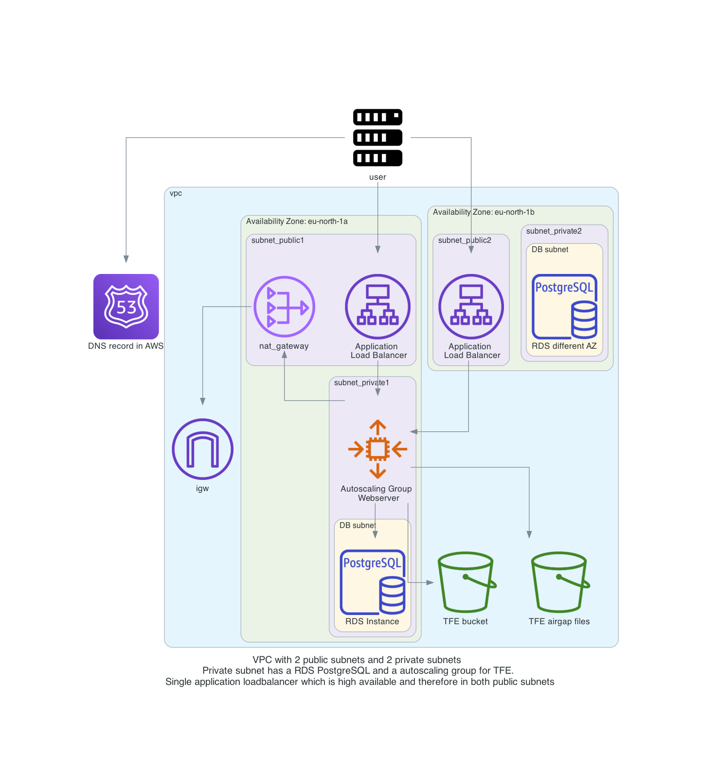

# Terraform Enterprise Autoscaling - Airgap installation with External Services (S3 + PostgreSQL)

With this repository you will be able to do a TFE (Terraform Enterprise) airgap installation on AWS with external services for storage in the form of S3 and PostgreSQL. The server configuration is done by using an autoscaling launch configuration. The TFE instance will be behind a load balancer

The Terraform code will do the following steps

- Create S3 buckets used for TFE
- Upload the necessary software/files for the TFE airgap installation to an S3 bucket
- Generate TLS certificates with Let's Encrypt to be used by TFE
- Create a VPC network with subnets, security groups, internet gateway
- Create a RDS PostgreSQL to be used by TFE
- Create an autoscaling launch configuration which defines the TFE instance and airgap installation
- An auto scaling group that points to the launch configuration
- Create an application load balancer for communication to TFE


# Diagram

  

# Prerequisites

## License
Make sure you have a TFE license available for use

Store this under the directory `airgap/license.rli`

## Airgap software
Download the `.airgap` file using the information given to you in your setup email and place that file under the directory `./airgap`

Store this for example under the directory `airgap/610.airgap`

## Installer Bootstrap
[Download the installer bootstrapper](https://install.terraform.io/airgap/latest.tar.gz)

Store this under the directory `airgap/replicated.tar.gz`

## AWS
We will be using AWS. Make sure you have the following
- AWS account  
- Install AWS cli [See documentation](https://docs.aws.amazon.com/cli/latest/userguide/install-cliv2.html)

## Install terraform  
See the following documentation [How to install Terraform](https://learn.hashicorp.com/tutorials/terraform/install-cli)

## TLS certificate
You need to have valid TLS certificates that can be used with the DNS name you will be using to contact the TFE instance.  
  
The repo assumes you have no certificates and want to create them using Let's Encrypt and that your DNS domain is managed under AWS. 


# How to

- Clone the repository to your local machine
```sh
git clone https://github.com/munnep/tfe_airgap_asg.git
```
- Go to the directory
```sh
cd tfe_airgap_asg
```
- Set your AWS credentials
```sh
export AWS_ACCESS_KEY_ID=
export AWS_SECRET_ACCESS_KEY=
export AWS_SESSION_TOKEN=
```
- Store the files needed for the TFE Airgap installation under the `./airgap` directory, See the notes [here](./airgap/README.md)
- create a file called `variables.auto.tfvars` with the following contents and your own values
```hcl
tag_prefix               = "patrick-airgap2"                          # TAG prefix for names to easily find your AWS resources
region                   = "eu-north-1"                               # Region to create the environment
vpc_cidr                 = "10.234.0.0/16"                            # subnet mask that can be used 
ami                      = "ami-09f0506c9ef0fb473"                    # AMI of the Ubuntu image  
rds_password             = "Password#1"                               # password used for the RDS environment
filename_airgap          = "610.airgap"                               # filename of your airgap software stored under ./airgap
filename_license         = "license.rli"                              # filename of your TFE license stored under ./airgap
filename_bootstrap       = "replicated.tar.gz"                        # filename of the bootstrap installer stored under ./airgap
dns_hostname             = "patrick-tfe6"                             # DNS hostname for the TFE
dns_zonename             = "bg.hashicorp-success.com"                 # DNS zone name to be used
tfe_password             = "Password#1"                               # TFE password for the dashboard and encryption of the data
certificate_email        = "patrick.munne@hashicorp.com"              # Your email address used by TLS certificate registration
terraform_client_version = "1.1.7"                                    # Terraform version you want to have installed on the client machine
public_key               = "ssh-rsa AAAAB3Nza"                        # The public key for you to connect to the server over SSH
asg_min_size             = 1                                          # autoscaling group minimal size. Currently 1 is the only option
asg_max_size             = 1                                          # autoscaling group maximum size. Currently 1 is the only option
asg_desired_capacity     = 1                                          # autoscaling group desired capacity. Currently 1 is the only option
```
- Terraform initialize
```sh
terraform init
```
- Terraform plan
```sh
terraform plan
```
- Terraform apply
```sh
terraform apply
```
- Terraform output should create 46 resources and show you the public dns string you can use to connect to the TFE instance
```sh
Apply complete! Resources: 46 added, 0 changed, 0 destroyed.

Outputs:

ssh_tf_client = "ssh ubuntu@patrick-tfe3-client.bg.hashicorp-success.com"
ssh_tfe_server = "ssh -J ubuntu@patrick-tfe3-client.bg.hashicorp-success.com ubuntu@<internal ip address of the TFE server>"
tfe_appplication = "https://patrick-tfe3.bg.hashicorp-success.com"
tfe_dashboard = "https://patrick-tfe3.bg.hashicorp-success.com:8800"
tfe_netdata_performance_dashboard = "http://patrick-tfe3.bg.hashicorp-success.com:19999"
```
- Connect to the TFE dashboard. This could take 10 minutes before fully functioning.  
See the url for tfe_dashboard in your terraform output. 
- Unlock the dashboard with password from your `variables.auto.tfvars`  
    
- Click on the open button to go to the TFE application page  
  
- Create the first account  

- create your organization and workspaces  
  
- When you are done you can destroy the entire environment
```sh
terraform destroy
```


# TODO


# DONE
- [x] able to connect to netdata information
- [x] swappiness
- [x] disks
- [x] use standard ubuntu image with docker installation
- [x] adding authorized keys 
- [x] create VPC
- [x] create 4 subnets, 2 for public network, 2 for private network
- [x] create internet gw and connect to public network with a route table
- [x] create nat gateway, and connect to private network with a route table
- [x] route table association with the subnets 
- [x] security group for allowing port 443 8800
- [x] transfer files to bucket
      - airgap software
      - license
      - Download the installer bootstrapper
- [x] Get an Airgap software download
- [x] RDS PostgreSQL database
- [x] Generate certificates with Let's Encrypt to use
- [x] import TLS certificate
- [x] create a LB (check Application Load Balancer or Network Load Balancer)
- [x] publish a service over LB TFE dashboard and TFE application
- [x] create DNS CNAME for website to loadbalancer DNS
- [x] install TFE
- [x] Auto scaling launch configuration
- [x] Auto scaling group creating


